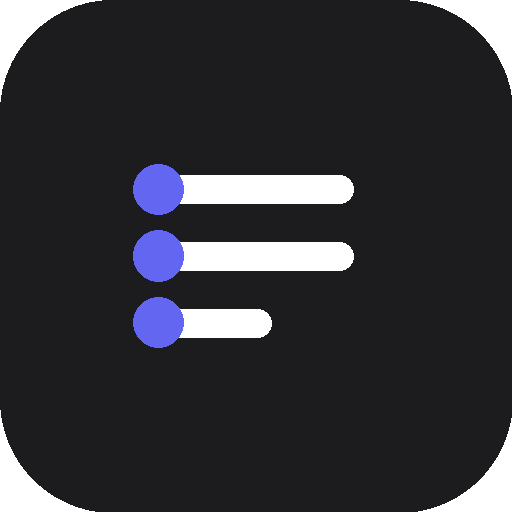

<p align="center">
  
</p>

<h1 align="center">ComputerFlow</h1>

<p align="center">
  <strong>Turn any task into an agent.</strong><br>
  Record on your Mac. Hand it off to the cloud. An AI agent runs your task — autonomously, forever.
</p>

<p align="center">
  <a href="https://computerflow.vercel.app">Website</a>
  ·
  <a href="https://computerflow.vercel.app/pitch">Pitch</a>
</p>

---

ComputerFlow is a macOS menu-bar app paired with a FastAPI backend that turns screen recordings into executable workflows. Record yourself doing a task once, let a VLM compile the recording into a structured SOP, review and edit the steps, then replay it in the cloud with a Computer Use Agent driving either a headless browser or a Linux desktop.

## How it works

The pipeline has four stages, driven from the Mac app's menu-bar icon:

1. **Record** — Click *Start Recording* in the menu bar. The Mac app captures the screen via `ScreenCaptureKit`, logs per-event telemetry (clicks, keystrokes, hotkeys), and saves a pre-action screenshot for every event. On stop it uploads the video, the events JSON, and the per-event screenshots to the backend.
2. **Compile** — The backend's `/workflows/upload` endpoint stores the recording and kicks off a background compile task. Events are coalesced (consecutive keystrokes become `type` steps, modified keys become `hotkey` steps), chunked, and sent to a VLM along with their pre-action screenshots. The VLM returns a structured `workflow.json` containing named steps, executor routing hints, and input variables. Progress streams back to the Mac app over a WebSocket.
3. **Review** — When the compile finishes the app opens a confirmation window showing the inferred steps. The user can edit intents, fix targets, change executors, or declare variables before saving.
4. **Run** — Clicking *Run* hits `POST /workflows/{id}/run`. The backend's `ComputerFlowRunner` groups consecutive steps by execution target, creates the right cloud session (Kernel browser or Lightcone desktop), and drives each step with the Northstar CUA model. Live view URLs and per-frame screenshots stream back to the Mac app's picture-in-picture window.

## Architecture

```
 ┌─────────────────────────────┐                          ┌───────────────────────────────┐
 │  macOS menu-bar app         │                          │  FastAPI backend              │
 │  (SwiftUI + ScreenCaptureKit)│   HTTP  upload/run       │  app/main.py                  │
 │                              │◄────────────────────────►│                               │
 │   • ScreenRecorder           │   WebSocket  progress    │   /workflows/upload           │
 │   • EventTelemetry           │                          │   /workflows/{id}             │
 │   • WorkflowStore            │                          │   /workflows/{id}/run         │
 │   • Review + PiP windows     │                          │   /runs/{id}/control          │
 └─────────────────────────────┘                          │                               │
                                                          │   compiler/ (VLM)             │
                                                          │     ├─ lightcone_vlm.py       │
                                                          │     └─ claude_vlm.py          │
                                                          │                               │
                                                          │   infra/runner.py             │
                                                          │     ComputerFlowRunner        │
                                                          └──────────┬────────────────────┘
                                                                     │
                                       ┌─────────────────────────────┼─────────────────────────────┐
                                       ▼                             ▼                             ▼
                              ┌─────────────────┐          ┌──────────────────┐          ┌──────────────────┐
                              │  Kernel         │          │  Lightcone OS    │          │  Local agent     │
                              │  cloud Chromium │          │  Linux desktop   │          │  localhost:27182 │
                              │  + live view    │          │  + live view     │          │  (user machine)  │
                              └─────────────────┘          └──────────────────┘          └──────────────────┘
                                       ▲                             ▲                             ▲
                                       └───────── Northstar CUA model (tzafon.northstar-cua-fast) ──┘
```

## Providers

ComputerFlow stitches together three external services:

- **Kernel** (`onkernel.com`) — Headless cloud Chromium sessions via `AsyncKernel`. Each browser run gets a `browser_live_view_url` so the Mac app can embed a live preview, plus optional session replay recordings. Used for any step whose executor resolves to `kernel` (browser automation).
- **Lightcone / Tzafon Northstar** — Two roles. *Lightcone OS* provides persistent cloud Linux desktop sandboxes (`lc.computers.create(kind="desktop")`) for full-desktop automation. *Northstar* is the CUA (Computer Use Agent) model the runner calls in a screenshot-to-action loop on both Kernel and Lightcone surfaces. The live-view debug URL from Lightcone is also surfaced to the app.
- **Claude Sonnet 4.6 / Lightcone Northstar** — Interchangeable VLM backends for the compiler that turns recordings into `workflow.json`. Selected at runtime via `COMPILER=claude` or `COMPILER=lightcone` (default). Both consume the same prompt set (`app/compiler/lightcone_prompts.py`) and chunk recordings into 5-screenshot batches with continuation context between calls.

The runner cleanly hands off between targets inside a single flow: consecutive steps sharing a target run in one session; when the target changes the old session stays open in case the flow toggles back.

## Setup

### Environment variables

Copy `backend/.env.example` to `.env` at the project root and fill in keys:

```
ANTHROPIC_API_KEY=sk-ant-...        # required if COMPILER=claude
LIGHTCONE_API_KEY=sk_...            # Lightcone / Tzafon Northstar (alias: TZAFON_API_KEY)
KERNEL_API_KEY=sk_...               # Kernel cloud browser
COMPILER=lightcone                  # or "claude"
```

Optional: `NVIDIA_API_KEY`, `NIM_BASE_URL`, `BREV_WORKSPACE`, `DATABASE_URL`.

### Backend

```
cd backend
pip install -e ".[dev]"
uvicorn app.main:app --reload --port 8000
```

On first start the backend creates `./data/computerflow.db` (SQLite) and `./data/workflows/{id}/` for each recording. Health check at `http://localhost:8000/health`.

### macOS app

```
bash scripts/build_mac.sh
```

This runs `swift build -c release`, assembles `build/ComputerFlow.app`, ad-hoc signs it with entitlements, and installs it to `/Applications/ComputerFlow.app`. On first launch macOS prompts for **Screen Recording** and **Accessibility** permissions — grant both in *System Settings → Privacy & Security*. The build script opens the right preferences pane automatically.

Requires macOS 14+ and a Swift 5.9 toolchain.

## Usage

1. Launch ComputerFlow — a record-circle icon appears in the menu bar.
2. Click the icon, pick a display, and press **Start Recording**. The icon turns red with a REC badge.
3. Perform the task you want to automate.
4. Click the menu-bar icon again and press **Stop**. The icon switches to a CPU glyph while the backend compiles (progress streams back inline).
5. A review window opens with the compiled steps — edit intents, retarget elements, declare input variables, then **Save**.
6. From the saved workflow list, click **Run**. A picture-in-picture window opens showing the Kernel or Lightcone live view while Northstar drives the task.
7. While running you can **Pause**, **Resume**, **Take Control**, or **Stop** via `/runs/{id}/control`.

## Project structure

```
mac/        SwiftPM package for the menu-bar app (ScreenCaptureKit + SwiftUI)
backend/    FastAPI server, compiler backends, execution runner, SQLite store
scripts/    build_mac.sh plus end-to-end smoke tests for browser/desktop flows
data/       Runtime-only — SQLite DB and per-workflow videos/events/screenshots
```

## Tech stack

Swift 5.9 · SwiftUI · ScreenCaptureKit · FastAPI · SQLAlchemy · SQLite · httpx · Anthropic SDK · Tzafon/Lightcone SDK · Kernel SDK · Northstar CUA.
